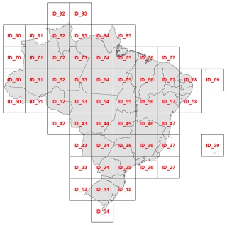
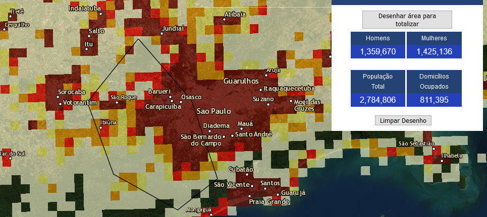

# Grade Estatística IBGE



Sumário:

* [CONVENÇÕES DO IBGE](#convenções-do-ibge)
    * [Estrutura das tabelas](#estrutura-das-tabelas)
    * [Nomenclatura das células](#nomenclatura-das-células)
* [ALGORITMOS IMPLANTADOS](#algoritmos-implantados)
    * [Resolução dos identificadores de célula](#resolução-dos-identificadores-de-célula)
    * [Resolução de ponto em célula](#resolução-de-ponto-em-célula)
    * [Adaptações para outros países](#adaptações-para-outros-países)
* [BIBLIOTECA](#biblioteca)
    * API
* [INSTALAÇÃO](#instalação)
    * [Instalando somente o zip](#instalando-somente-o-zip)
    * [Reproduzindo o processo completo](#reproduzindo-o-processo-completo)

------------

O presente projeto oferece *scripts* para redistribuir mais eficientremente a Grade Estatística oficial do IBGE, e para aprimorar seu uso em bancos de dados. Resultou em uma versão otimizada, com os mesmos dados, porém viabilizando novas aplicações.

O principal objetivo foi oferecer uma **estrutura de dados alternativa** à estrutura original, batizada de **Grade Estatística IBGE Compacta**, com as seguintes **vantagens**: <!-- O principal objetivo destes *scripts* é oferecer uma **estrutura de dados alternativa** à estrutura original dos *shapfiles* de grade IBGE, com as seguintes **vantagens**:-->

1. **reduzir o tamanho da distribuição** da geometria da grade, de 849&nbsp;Mb (56 arquivos zip) para um só arquivo 44&nbsp;Mb zip (**5%** dos 849&nbsp;Mb).

2. **estruturar de forma mais simples**, capaz de reproduzir funcionalmente os dados estrutura originais, e capaz ainda de ser utilizada:  

   2.1. **em qualquer banco de dados SQL simples** (por ex. [SQLite](https://en.wikipedia.org/wiki/SQLite)), sem necessidade de extensões GIS ou geometria.

   2.2. **no [PostGIS](https://en.wikipedia.org/wiki/PostGIS)** com as mesmas (ou mais) aplicações que a distribuição original. <br/>Em paricular **otimizar** os algoritmos de "resolução dos identificadores de célula" (*encode/decode*), e de posição espacial em identificador de célula.

3. **reduzir a ocupação em disco no banco de dados SQL** (a 20% ou menos do tamanho original).

4. **distribuir em formato mais aberto** (não-proprietário) e mais simples e interoperável do que o [Shapefile](https://en.wikipedia.org/wiki/Shapefile): o formato [CSV](https://en.wikipedia.org/wiki/Comma-separated_values) é legível até por planilha (ex. Excel) e é um padrão aberto universal.

# CONVENÇÕES DO IBGE

Em janeiro de 2016 o IBGE publicou mais formalmente a sua Grade Estatística em [grade_estatistica/censo_2010](https://geoftp.ibge.gov.br/recortes_para_fins_estatisticos/grade_estatistica/censo_2010/), do site `IBGE.gov.br`, onde podemos acessar livremente o [documento de justificativas](https://geoftp.ibge.gov.br/recortes_para_fins_estatisticos/grade_estatistica/censo_2010/grade_estatistica.pdf) (que infelizmente não pode ser utilizado como referência técnica) e os arquivos da geometria da grade em *shapfile*.

Se você nunca havia antes ouvido falar, veja o [filminho didáco sobre ela](https://www.youtube.com/watch?v=s5yrDV_c2-4), ou explore o Censo 2010 através da [grade *online*](https://mapasinterativos.ibge.gov.br/grade/default.html) (ilustração abaixo).



 A "grade" do IBGE é na verdade um **conjunto hierarquizado de grades** (ou _"grid system"_), aparentemente seguindo as recomendações [INSPIRE *D2.8.I.2*](https://inspire.ec.europa.eu/documents/Data_Specifications/INSPIRE_DataSpecification_GG_v3.1.pdf), "Data Specification on Geographical Grid Systems – Technical Guidelines" de 2014, ou anterior.

Cada quadrante da grade IBGE  de menor escala (na ilustração acima a grade nível *L0*) é subdividio em quadrados com lado medindo 1/5 ou 1/2 do seu tamanho para formar a grade seguinte, de menor escala e maior resolução.
A grade seguinte à *L0*, a *L1*, tem quadrados com 500/5&nbsp;km&nbsp;=&nbsp;100&nbsp;km de lado; a seguinte *L2* com 100/2&nbsp;km&nbsp;=&nbsp;50&nbsp;km; *L3* com 50/5&nbsp;km&nbsp;=&nbsp;10&nbsp;km; *L4* com 10/2&nbsp;km&nbsp;=&nbsp;5&nbsp;km; *L6* com 5/5&nbsp;km&nbsp;=&nbsp;**1&nbsp;km**.

Na distribuição da gemetria das grades de 200m e 1km foram acrescentados **dados relevantes do Censo de 2010**.
A seguir a descrição dessa grade mesclada aos dados. Dada a precariedade da documentação, **algumas dúvidas permanecem**, e outras foram deduzidas por reengenharia, também descrita a seguir.

## Estrutura das tabelas

Todas as tabelas criadas pelos *shapfiles* originais do IBGE (vide ) possuem a estrutura:

Column   |            Type             | Comments                 
----------|----------------------------|---------
`gid`        | integer                     | ID de tabelas de geometria, gerado por antigo padrão.<br/>Nota: é otimizável como indexador porém redundante com `id_unico`.
`id_unico`   | character varying(50)       | ID real da célula. String do tipo `{lado}E{X}N{Y}`, com referência XY na projeção Albers.
`nome_1km`   | character varying(16)       | (redundante) Apoio na agregação de 1 km.
`nome_5km`   | character varying(16)       | (redundante) Apoio na agregação de 5 km.
`nome_10km`  | character varying(16)       | (redundante) Apoio na agregação de 10 km.
`nome_50km`  | character varying(16)       | (redundante) Apoio na agregação de 50 km.
`nome_100km` | character varying(16)       | (redundante) Apoio na agregação de 100 km.
`nome_500km` | character varying(16)       | (redundante) Apoio na agregação de 500 km.
`quadrante`  | character varying(50)       | (redundante) Localiza o quadrante ou apoia a agregação de 500 km.
`masc`       | integer                     | população do sexo masculino
`fem`        | integer                     | população do sexo feminino
`pop`        | integer                     | população total (conforme Censo 2010) no interior da célula
`dom_ocu`    | integer                     | domicílios ocupados - particulares permanentes, particulares improvisados e coletivos (todos as categorias da V4001 - Espécie no Censo Demográfico 2010).
`shape_leng` | numeric                     | (redundante)
`shape_area` | numeric                     | (redundante)
`geom`       | geometry(MultiPolygon,4326) | geometria da célula em coordenadas LatLong WGS84 (sem projeção)

## Nomenclatura das células

Em qualquer quadrante *qq* o resultado de `SELECT DISTINCT substr(id_unico,1,4) id_prefix FROM grade_IDqq` será o conjunto
{"1KME",&nbsp;"200M"}. Isso significa que todos os demais atributos `nome_*` (e `quadrante`) da estrutura acima, são reduntantes. Só existem esses dois tipos de célula, sendo a menor delas, 200 m, usada para o meio urbano, onde se faz necessária uma cobertura mais densa. No caso das células com `id_prefix` "1KME", de 1 km de lado, teremos `id_unico=nome_1km`.

Quanto ao signiicado do valor de `id_unico`, que segue a *URI Template* `{lado}E{X}N{Y}`, onde `lado` é o tamanho do lado da célula, `X` e `Y` as "coordenadas da célula" tendo como referência o seu canto... Qual canto?
Tomando como referência as coordenadas do centro da geometria (função PostGIS `ST_Centroid`)
percebemos que o IBGE não adotou uma convenção regular: para células de 1 km basta truncar ou usar o canto inferior direito,
mas para células de 200 metros é o canto superior direito.

```SQL
SELECT * FROM (
  SELECT is_200m, id_unico_parts,
       round( ST_x(ST_Transform(geom,952019)) + iif(is_200m,-100,-500) )::int x,
       round( ST_y(ST_Transform(geom,952019)) + iif(is_200m,+100,-500) )::int y
  FROM (
    SELECT substr(id_unico,1,4)='200M' AS is_200m,
      CASE
        WHEN id_unico=nome_1km THEN array[substr(id_unico,5,4), substr(id_unico,10)]
        ELSE  array[substr(id_unico,6,5), substr(id_unico,12)]
        END id_unico_parts,
      ST_centroid(st_transform(geom,952019)) as geom
    FROM grade_id45
  ) t1
) t2 -- WHERE homologando a heuristica da nomenclatura das células:
WHERE substr(x::text,1,length(id_unico_parts[1]))!=id_unico_parts[1]
   OR substr(y::text,1,length(id_unico_parts[2]))!=id_unico_parts[2]
ORDER BY 1;
```
O algoritmo foi validado contra células de 200m (flag `is_200m`) e 1km. conforme `id_unico`.  Para as células de 200m foram validadas as coordenadas "X_centro-100" e "Y_centro+100", para células de 1km as coordenadas "X_centro-500" e "Y_centro-500".

A mesma heuristca pode ser utilizada para a recuperação de dados a partir do identificador IBGE das células de 200 m e de 1 km. A generalização para células maiores (10 km, 50 km etc.) requer uma avaliação mais detalhada, a seguir.

# ALGORITMOS IMPLANTADOS

Os scripts possuem duas finalidades:

1. Popular uma base de dados PostgreSQL **com as tabelas dos _shapefiles_ originais** da distribuição IBGE.

2. Criar e popular com os dados originais uma nova estrutura, **mais compacta** e eficiente para a **indexação de outros dados** e a **resolução dos identificadores de célula**.

Na [seção INSTALAÇÃO](#instalação) abaixo, descreve-se como cada uma dessas estruturas de dados pode ser intaladas com um simples comando com o número da alternativa (1 ou 2).

A seguir a descrição dos algoritmos que geram a conversão da grade original em compacta, e vice-versa, que transformam a compacta em original, e outros recursos.

## Estrutura compacta

Com rótulo e geometria compactados em um simples inteiro de 64 bits (*bigint* no PostgreSQL), e eliminando outras redundâncias, as informações da grade original podem ser transferidas, sem perdas, para a seguinte estrutura:

Column         |   Type   | Comments
---------------|----------|--------------
`gid`          | bigint  NOT NULL PRIMARY KEY | coordenadas (`x*10`,`y*10`) do centroide de celula, formatadas como dois números de 30 bits concatenados.
`pop`          | integer  NOT NULL| população total dentro da célula.
`pop_fem_perc` | smallint NOT NULL| percentual da população feminina
`dom_ocu`      | smallint NOT NULL| domicílios ocupados

O codificador de coordenadas consegue compactar toda a informação de localização do centro da célula em um só número inteiro de 64 bits através das operações *bitwise*, e usando uma máscara de 30 bits. A *query* abaixo destaca a máscara de bits e ilustra a reversibilidade entre o número *xy* e as coordenadas (_x,y_)

```sql
SELECT (b'0000000000000000000000000000000000111111111111111111111111111111')::bigint = 1073741823,
       xy>>30 AS x,
       xy&1073741823 AS y
FROM ( SELECT (123456789::bigint<<30) | 987654321::bigint AS xy ) t;
-- Result: true, x=123456789, y=987654321
```

Como os valores mínimo e máximo das coordenadas XY dos centros de célula de todo o conjunto são, respectivamente, `(2809500,7599500)` e `(7620500,11920500)`, mesmo multiplicando por 10 ainda estão uma ordem de grandeza abaixo de `2^30-1 = 1073741823`. Cabem folgadamente em 30 bits e ainda sobram 4 bits para codificar o nível hierárquico da grade na qual se encontra o ponto. A representação final para os 64 bits do *gid*  proposto é a seguinte, em três partes:

* Primeiros 4 bits, `selgrid`, **selecionam a grade**: `b'0000'` = nível _L0_, grade 500&nbsp;km; `b'0001'` = nível _L1_, grade 100&nbsp;km; ...;  `b'0101'` = nível _L5_, grade 1&nbsp;km; `b'0110'` = nível _L6_, grade 200&nbsp;m.

* 30 bits seguintes, `x10`, **codificam X10**: a primeira coordenada XY Albers, multiplicada por 10 e arredondada.  

* 30 bits finais, `y10`, **codificam Y10**: a segunda coordenada XY Albers, multiplicada por 10 e arredondada.

Com isso podemos podemos indexar além das células fornecidas pelos shapfiles do IBGE, todas as demais, criando um grande e econômico _cache_ das grades de sumarização.

## Resolução dos identificadores de célula

A consulta abaixo funcionou para o quadrante 45 (tabela `grade_id45`) e algumas outras, mas falha para a grande maioria, principalmente quando o número de dígitos aumenta para acomodar a unicidade (por exemplo nos quadrantes do extremo norte).

Está pendente portanto um algoritmo, mesmo que heurístico, capaz de reproduzir a partir do centróide da célula o seu identificador IBGE.

```SQL
SELECT * FROM (
  SELECT array[substr(id,5+digs,4), substr(id,10+digs)] id_parts,
        round( (ST_x((geom)) - sub) / div )::int x,
        round( (ST_y((geom)) - sub) / div )::int y
  FROM (
    SELECT id, digs,
           CASE WHEN ld>100000 THEN 0.001 WHEN ld>10000 THEN 0.01 ELSE 0.1 END*ld AS div,
           CASE WHEN is_five THEN 0.25 ELSE 0.50 END*ld AS sub,
           ST_Transform(  ST_centroid( ST_Collect(geom) ),  952019) AS geom
    FROM (
      SELECT *,
        10^(3+digs + CASE WHEN is_five THEN 1 ELSE 0 END) as ld
        FROM ( SELECT t0a.*, is_five, digs FROM (
            SELECT *, nome_10km AS id --> Trocar por nome_1km, nome_5km, nome_50km ou nome_100km.
            FROM grade_id45 --> Trocar por outro quadrante (44,35,etc)
        ) t0a, LATERAL (SELECT
          substr(t0a.id,1,1)='5' AS is_five,
          length(t0a.id)-13 as digs
        ) t0b  
      ) t0c
    ) t0f
    GROUP BY 1,2,3,4
  ) t1
) t2  -- WHERE homologando a heuristica da nomenclatura das células:
WHERE substr(x::text,1,length(id_parts[1]))!=id_parts[1]
   OR substr(y::text,1,length(id_parts[2]))!=id_parts[2]
ORDER BY 1;
```

O comportamento regular esperado nos parâmetros de
`(X_centro-sub)/div` e `(Y_centro-sub)/div`
seria o seguinte:

Lado<br/>(km)|Exemplo| digs|   ld |  sub | div
----|-----------------|----|------|------|-----
1   | 1KME5300N9632   | 0  | 1000 | 500 | 100
5   | 5KME5300N9630   | 0  | 10000 | 2500 | 1000
10  | 10KME5300N9630  | 1  | 10000 | 5000 | 1000
50  | 50KME5300N9600  | 1  | 100000 | 25000 | 1000
100 | 100KME5300N9550 | 2  | 100000 | 50000 | 1000

Com arredondamento seguido de multipicação por 10 por exemplo pode-se amplicar o número de casos, mas ainda teriam de ser tratados quadrantes como o 83 (tabela `grade_id83`) onde os identificadores são maiores. Por exemplo 1KME4300N11825 e 5KME4300N11825 possuem 4 dígitos em X e 5 dígitos em Y.

<!--
SELECT DISTINCT min(id) as min_id digs, ld, sub, div
FROM (
  SELECT id, digs, ld,
         CASE WHEN ld>100000 THEN 0.001 WHEN ld>10000 THEN 0.01 ELSE 0.1 END*ld AS div,
         CASE WHEN substr(id,1,1)='5' THEN 0.25 ELSE 0.50 END*ld AS sub,
         ST_Transform(  ST_centroid( ST_Collect(geom) ),  952019) AS geom
  FROM (
    SELECT *,
      length(id)-13 as digs,
      10^(3+length(id)-13 + CASE WHEN substr(id,1,1)='5' THEN 1 ELSE 0 END) as ld
      FROM ( SELECT *, nome_10km AS id FROM grade_id83) t00
           -- Trocar por nome_1km, nome_5km, nome_50km ou nome_100km.
      ) t0
  GROUP BY 1,2,3,4, 5
) t1;
... como realizar a resulução dos geocodigos da Grade IBGE, exemplos:
* Solicitado XY relativo a `1KME5300N9350`: ...
* Solicitado XY relativo a `200ME53000N96322`: ...
-->

## Resolução de ponto em célula

A solução proposta na presente versão indexada por XY permite usar a representação interna invez da busca geométrica.
Por exemplo o ponto XY=(4580490.89,8849499.5) pode primeiramente ser arredondado para inteiros multiplicados por 10, e
em seguida a busca se realizaria através de indexão otimizada em cada coordenada, nas tabelas `mvw_censo2010_info_Xsearch` e `mvw_censo2010_info_Ysearch`.

Suponhamos a busca por **X=4580491** (que na representação inteira requer multiplicar por 10), ela será realizada pelo algoritmo:

```sql
SELECT x FROM (
  (
    SELECT x FROM grid_ibge.mvw_censo2010_info_xsearch
    WHERE x >= 4580491*10 ORDER BY x LIMIT 1
  )  UNION ALL (
    SELECT x FROM grid_ibge.mvw_censo2010_info_xsearch
    WHERE x < 4580491*10 ORDER BY x DESC LIMIT 1
  )
) t
ORDER BY abs(4580491*10-x) LIMIT 1;
```

Depois de fazer mesmo em Y, obtemos a suposta célula que contém o ponto XY solicitado.
A função  *search_cell* da biblioteca *grid_ibge* retorna não-nulo, em 0.042 ms, quando existe uma célula contendo o ponto:
```SQL
SELECT * FROM grid_ibge.censo2010_info
WHERE xy=grid_ibge.search_cell(4580490.89::real, 8849499.5::real);
```

## Adaptações para outros países

Conforme necessidades, os _scripts_ SQL podem ser facilmente adaptados, desde que refatorando nos diversos scripts. As adaptações mais comuns são:

* SRID da projeção Albers do IBGE: mude o valor 952019 para o valor desejado.

* Uso do *SQL schema* `public` (sem *schema*) no lugar de : basta eliminar os comandos DROP SCHEMA e CREATE SCHEMA correspondentes, e alterar todas as ocorrências de `grid_ibge.` para `public.`.

* Discarte do preparo: a operação de `DROP CASCADE` pode ser comentada caso esteja realizando testes, fazendo por partes, ou reusando o *schema* em outras partes do seu sistema.

----------------

## BIBLIOTECA
Principais funções, para a manipulação da grade compacta e conversão entre as representações original e compacta, todas do SQL SCHEMA `grid_ibge`:

* `coordinate_encode(x real, y real, level int)`: compacta as coordenadas XY Albers de centro de célula em *gid*, com respectivo nível da célula.

* `coordinate_encode10(x10 int, y10 int, level int)`: faz o trabalho para `coordinate_encode()`, já que internamente a representação é por inteiros XY10.

* `coordinate_decode10(gid bigint)`: retorna centro XY10 e nível da célula identificada por *gid*.

* `level_decode(gid bigint)`: devolve apenas o nível da célula identificada por *gid*.

* `level_to_size(level int)`: devolve o tamanho de lado da célula conforme a convenção de níveis (0 a 6) adotada.   

* `search_xy10(p_x10 int, p_y10 int, p_level smallint)`: descobre a célula onde está contido o ponto XY10, por hora preparando para rodar apenas com p_level=5.

* `search_cell(p_x real, p_y real, p_level smallint)`: idem `search_xy10()` porém partindo das coordenadas XY Albers.

* `draw_cell(gid bigint)`: desenha célula identificada por *gid*.

<!--
* grid_ibge.coordinate_encode10:
* grid_ibge.coordinate_encode(x real, y real, level int)
* grid_ibge.coordinate_encode(x real, y real, is_200m boolean)
* grid_ibge.coordinate_encode(x real, y real)
* grid_ibge.coordinate_encode10(x10 int, y10 int, level int)
* grid_ibge.coordinate_decode10(gid bigint)
* grid_ibge.level_decode(gid bigint) RETURNS int AS $f$
* grid_ibge.level_to_size(level int)  
* grid_ibge.search_xy10(p_x10 int, p_y10 int, p_level smallint)
* grid_ibge.search_cell(p_x real, p_y real, p_level smallint)
* grid_ibge.xy10_to_quadrante()
* grid_ibge.xy_to_quadrante()
* grid_ibge.gid_to_quadrante(p_gid bigint)
* grid_ibge.draw_cell(real,real,int,boolean,int)
* grid_ibge.draw_cell(int,int,int,boolean,int)
* grid_ibge.draw_cell(int[],int,boolean,int)
* grid_ibge.draw_cell(bigint,boolean,int)
-->

### API
Funções de resolução para uso na API.

* ...
* Endpoint `br_ibge.osm.org/{cell_id}`:  retorna célula solicitada na sintaxe original,  por exemplo `5KME5300N9630`.
* Endpoint `br_ibge.osm.org/geo:{lat},{long}`:  efeua `search_cell(p_x,p_y,5)`, ou seja, retorna célula de 1km.
* Endpoint `br_ibge.osm.org/geo:{lat},{long};u={uncertainty}`: usa a incerteza para deduzir o nível mais próximo e efeuar `search_cell(p_x,p_y,p_level)`. Por exemplo erro de 5km a 10km retorna células de 10 km.
* ...  

## INSTALAÇÃO

Use no terminal, a parir desta pasta, o comando `make` para listar as alternativas de instalação integral (*all1* ou *all2* descritas abaixo), que rodam todos os  _targets_ necessários, exceto `clean`. O comando `make` sem target informa também o que fazem os demais targets, que podem ser executados em separado.

Na pasta anterior, em [/src/README.md](../README.md), as versões e configurações necessárias são detalhadas.

### Instalando somente o zip
Recomenda-se o mais simples, que é obter a **Grade Estatística IBGE Compacta** diretamente a partir do CSV zipado desta distribuição git. Basta executar, em terminal Linux:

```sh
make all2
```

### Reproduzindo o processo completo

Se o objetivo for reproduzir, auditorar ou atualizar a  partir da **Grade Estatística IBGE Original**, demora um pouco mais e requer um pouco mais de espaço em disco, mas é igualmente simples. Basta executar no terminal Linux, nesta pasta, o comando:

```sh
make all1
```

Ou executar, na sequência, cada um dos _targets_ definidos nas dependências de *all1*.
No final de `make grid_orig_get` (ou meio do `make all1`) todas as tabelas de quadrantes,  `grade_id*`, terão sido criadas:
```
 grade_id04: 66031 itens inseridos
 grade_id13: 31126 itens inseridos
 grade_id14: 537732 itens inseridos
 grade_id15: 306162 itens inseridos
 ...
 grade_id92: 5091 itens inseridos
 grade_id93: 1901 itens inseridos
(56 rows)
```

Executando em seguida o `make grid_alt1_fromOrig` (final do `make all1`), as tabelas são lidas e as geometrias de célula são convertidas em coordenadas de centro (na função `grid_ibge.censo2010_info_load()`), para formar o identificador de célula com representação binária compacta (representado em *bigint*) na tabela `grid_ibge.censo2010_info`.  O resultado será resumido pela comparação:

resource            | tables | tot_bytes  | tot_size | tot_lines | bytes_per_line
--------------------|--------|------------|----------|-----------|-----------
Grade IBGE original |     56 | 4311826432 | 4112 MB  |  13286489 |        325
Grade compacta      |      1 |  588341248 | 561 MB   |  13286489 |         44

<!-- old Grade compacta      |      1 |  693272576 | 661 MB   |  13286489 |         52 -->
A tabela da nova grade pode ainda ser gravada como CSV,  

```sql
COPY grid_ibge.censo2010_info TO '/tmp/grid_ibge_censo2010_info.csv' CSV HEADER;
```
Se por acaso o IBGE gerar uma nova versão da grade original, o arquivo CSV deve então ser zipado com o comando `zip` Linux e gravado no presente repositório *git*, na pasta [/data/BR_IBGE](https://github.com/AddressForAll/grid-tests/tree/main/data/BR_IBGE).
