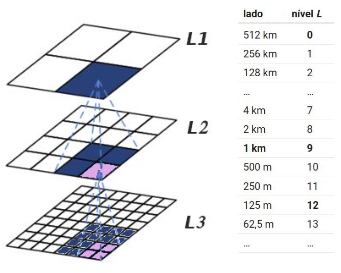
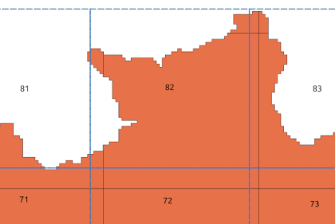
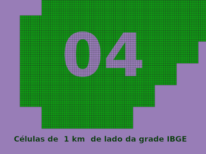
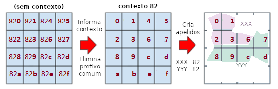

## Geohash adaptado à Grade Estatística IBGE

A *grade estatística oficial* de um país é um **mosaico de polígonos regulares e de igual-área** que cobre todo o seu território. Sendo definida por uma norma oficial e estável, a grade não muda com o tempo. Por ser [espacialmente regular](https://en.wikipedia.org/wiki/Euclidean_tilings_by_convex_regular_polygons), permite a conversão automática entre grandezas extensivas (ex. população de um município) e intensivas (ex. densidade populacional num ponto), entre [geo-objetos e geo-campos](https://doi.org/10.1080/13658810600965271).

A grade é tão importante que não pode ficar restrita a apenas um tipo de uso, a Grade Estatística do IBGE pode manter suas características originais, suprindo as necessidades do Censo, e ir além: através das adaptações propostas ela conquistaria outros nichos de uso, contemplando **múltiplas finalidades**. Por exemplo o uso da grade em dados oficiais da Saúde ou do Meio Ambiente, ou os identificadores da grade (geocódigos) para a localização de endereços postais em operações logísticas e no agroneǵócio.

A **proposta de "Nova Grade IBGE" do Instituto AddressForAll** teve por objetivo:

1. [reutilizar a "**grade de 1 km**"](../BR_IBGE/README.md#grade1km) (com células de 1 km de lado) da Grade Estatística do IBE;

2. incluir **mais níveis hierárquicos** entre as grades de 500 km e de 1km;

3. proporcionar um [sistema de **geocódigos hierárquicos**](https://en.wikipedia.org/wiki/Geocode#Hierarchical_grids) e compactos sobre a grade;

4. fazer uso apenas de tecnologia aberta e de **alta performance** computacional, tanto na indexação (bancos de dados) como na resolução (tradução do geocódigo da célula em localização no mapa).

A solução de geocódico encontrada foi o [algortimo Geohash](https://en.wikipedia.org/wiki/Geohash), com pequenas adaptações denominadas [Geohash Generalizado](https://ppkrauss.github.io/Sfc4q/). O restante do processo de desenvolvimento da nova grade foi orientado pela tentativa de se preservar outras caracterísicas interessantes da grade IBGE, tais como a escolha do recorte sobre a América do Sul.

------

## Apresentação das decisões de projeto

A Grade Estatística IBGE é distribuída livremente em [grade_estatistica/censo_2010](https://geoftp.ibge.gov.br/recortes_para_fins_estatisticos/grade_estatistica/censo_2010/), do site `IBGE.gov.br`.  Neste link você pode encontrar a "articulação", que é o mosaico de células do nível hierárquico mais grosseiro da grade. Em outras palavras, é a "grade IBGE nível zero", *L0*. Ela é composta quadrados de 500 km de lado, apelidados de _quadrantes_, e cada um com seu identificador numérico, do 04 ao 93.

Quando sobrepomos a articulação original à nossa proposta (numa primeira tentativa centramos no quadrante 45), percebemos que são muito parecidas.

 A "grade" do IBGE é na verdade um **conjunto hierarquizado de grades**. Cada quadrante da grade IBGE original é subdividio em quadrados com lado medindo 1/5 ou 1/2 do seu tamanho para formar a grade seguinte, de maior resolução.
A grade seguinte à *L0*, a *L1*, tem quadrados com 500/5&nbsp;km&nbsp;=&nbsp;100&nbsp;km de lado; a seguinte *L2* com 100/2&nbsp;km&nbsp;=&nbsp;50&nbsp;km; *L3* com 50/5&nbsp;km&nbsp;=&nbsp;10&nbsp;km; *L4* com 10/2&nbsp;km&nbsp;=&nbsp;5&nbsp;km; *L6* com 5/5&nbsp;km&nbsp;=&nbsp;**1&nbsp;km**.

O ponto de partida na adaptação foi "**reutilizar a grade de 1 km**" (item 1 dos objetivos), que é a grade IBGE nível‑6, _L6_. Nesta reutilização está implícito também o reuso da  **Projeção Cônica de Albers padronizada pelo IBGE**.

A Nova Grade tem a liberdade de ser um pouco maior, mas idealmente sua grade mais grosseira (*L0*) estaria ainda "encaixada" na articulação dos quadrantes da grade *L0* do  IBGE. No sistema Geohash Generalizado as células da grade do  nível seguinte são particionadas em 4, de modo que a cada nível o tamanho de lado da célula é dividido por 2, conforme a ilustração abaixo.

Como nosso ponto partida foi a grade de 1 km, devemos multiplicar por 2 sucessivamente até chegar num tamanho próximo de 500 km, e elegendo o mesmo como nível zero, *L0*, da Nova Grade.

Na tabela acima, da nossa proposta, os quadrantes *L0* "engordaram" dos 500 km da garde original para 512 km. Uma boa aproximação, pois **90% das células de 1 km podem permamencer com identificador de quadrante compatível** com a articulação original.

Apesar de pouco acréscimo na grade final, percebemos que, a cada célula, os 6 km maiores nas 4 direções poderiam ser suficientes para **ampliar a grade ao  norte**, a ponto de eliminar a necessidade dos quadrantes 92 e 93. **Decidimos então encaixar a grade *L0* pelo quadrante 25**, que cobre a cidade de São Paulo. O resultado foi o acréscimo de 7*6 km = 43 km ao norte, garantindo (com folga de 1km) essa eliminação:

Um zoom na expansão ao norte mostra as porções dos quadrantes 92 e 93 que na nova grade foram incorporados aos quadrantes 82 e 83.

O conceito de "grade completa" e "cobertura Brasil", bem como a distorção espacial acarretada pela Projeção Cônica,  podem ser melhor percebidos de longe, no contexto continental:

Graças à projeção os quadradinhos traçados na grade possuem todos a mesma área, e portanto seus dados (ex. população por célula) podem ser comparados. Isso amplia enormemente o leque de aplicações da grade e dos geocódigos baseados nela.

A grade mais importante para os dados do IBGE, a de 1 km, continua a mema. Se olharmos com _zoom_ para o extremo Sul, no  interior do quadrante 04 da Nova Grade, usando a estratégia de descartar células que não cobrem o território nacional, encontraremos em verde a grade não-descartada dos dados originais do Censo de 2010:

## Mais níveis e geocódigos hierárquicos

Um importante  objetivo da Nova Grade, listado acima como item 3, foi proporcionar um sistema de *geocódigos hierárquicos e compactos* sobre a grade. Além disso, conforme item 2, essa hierarquia deveria apresentar mais níveis. Para tanto adotamos o algoritmo Geohash Generalizado e mais de uma opção de representação dos seus geocódigos ([bases 16, 16h e 32](https://ppkrauss.github.io/Sfc4q/)), todos partindo da representação com 2 dígitos no nível *L0* dos quadrantes.

<!-- Por exemplo as células de 500 metros, ou se preferir as de 1km, podem ser univocamente identificas por Geohashes Generalizados de quatro dígitos da base32. Voltando ao exemplo do quadante 04 no extremo sul, nas procimidades do Chui, cada célula tem seu identificador e está contida em células maiores com mesmo prefixo:

-->
O algoritmo Geohash está fundamentado na partição uniforme e recorrente de células quadriláteras em 4 sub-células, indexando as células através da Curva de Morton. Abaixo ilustrando com base 16h, que apresenta geocódigos consistentes também para os níveis intermediários, como o L1:

Seguindo com mais partições recorrentes, que resultam em quadados de lado 256&nbsp;km, 128&nbsp;km, 64&nbsp;km, ... chegamos ao 1&nbsp;km depois da 9ª&nbsp;partição. São portanto  9 níveis, ao invés dos 6 da grade original, e podemos seguir indefinidamente até por exemplo ~1 m, com a mesma regra.

Em termos de representação por *geocódigo hierárquico* as grades podem ainda ser representadas por um sistema distorcido, com células retangulares, para acomodar o dobro de níveis (9*2=18) entre 512 km e 1 km. Como diferentes aplicações exigem diferentes graus de compactação no Geocódigo, são oferecidas as seguintes opções de padronização, conforme tipo de aplicação:

Notação e suas aplicações|Níveis hierárquicos (bits no geocódigo)|Dígitos p. ~1km / Exemplos
----------|-------------------------------------------|-------------------
**Base 4** *Didáticas* e Computacionais|todos os níveis (**cada 2 bits**)|9 dígitos (nível 9) em 1 km; 10 dígitos (nível 10) em 500 m. / **Debug** no banco de dados
**Base 16h** *Científicas gerais*|todos níveis (**bit a bit**), inclusive  níveis-meios (ex. 2½)  |4+1 dígitos (nível 9) em 1 km; 5 dígitos (nível 10) em 500 m; 5+1 dígitos (nível 11) em 250 m; ... 7+1 dígitos (nível 15) em 15,6 m; ... 8+1 dígitos (nível 17½) em ~3 m; 9 dígitos (nível 18) em 2,0 m. / **Visualização de dados** em geral.
 **Base 16** (hexadecimal) *Científicas padronizadas*|níveis pares (**cada 4 bits**)|5 dígitos (nível 10) em 500 m; 8 dígitos (nível 16) em 7,8 m; 9 dígitos (nível 18) em 2,0 m. / **Nova Grade Estatítica do IBGE**.
**Base 32** *Gerais*|cada 2½ níveis (**cada 5 bits**) |4 dígitos (nível 10) em 500 m; 6 dígitos (nível 15) em 15,6 m; 7 dígitos (nível 17½) em ~3 m. / **Novo CEP**, escolas e usos oficiais

### Geocódigos curtos ou mnemônicos

Uma das funções implementadas de *encode*/*decode* da proposta, é a que confere _"encurtamento pelo contexto"_ ao gecódigo proposto.

Na ilustração as células com geocódigos `820`,&nbsp;`821`, `822`, `823`,&nbsp;`826` cobre o polígono contextualizador chamado&nbsp;**XXX**, que pode ser imaginado como um nome popular e já conhecido por todos. Como o prefixo&nbsp;`82` é comum a todas elas, os geocódigos podem ser reescritos conforme seu apelido, `XXX‑0`,&nbsp;`XXX‑1`, `XXX‑2`, `XXX‑3`,&nbsp;e&nbsp;`XXX‑6`. Dessa forma os habitantes da região, que já sabem decor o que significa XXX, podem  lembrar dos geocódigos mais facilmente do que o número aleatório 82. Idem para o polígono da localidade popular&nbsp;**YYY**.

Casos especiais:

* Se duas localidades compatilham partes de uma mesma célula, elas  compartilharão o uso da célula, e **a resolução entre porções de uma ou outra se derá pelo polígono**. Na ilustração a célula `826` é comportilhada, ou seja, coexistem as localizações `XXX-6` e `YYY-6` na mesma  célula.

* Se a célula não cabe na "caixa" do prefixo, mas cabe em uma caixa de mesmo tamanho, não tem problema, os identificadores não se repetem.  **Por convenção adota-se como prfixo de referência a "caixa" que contém o centróide** do polígono.  
  
------

## Instalação

Use `make` para ver instruções e rodar _targets_ desejados. O software foi testado em PostgreSQL v12 e v13, e PostGIS v3.
