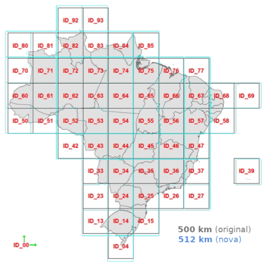

## Geohash adaptado à Grade Estatística IBGE

A grade hierárquica IBGE é distribuída livremente em [grade_estatistica/censo_2010](https://geoftp.ibge.gov.br/recortes_para_fins_estatisticos/grade_estatistica/censo_2010/) do site `IBGE.gov.br`.  Neste link você pode encontrar a "articulação", que é o mosaico de células do nível hierárquico mais grosseiro da grade, ou seja, a "grade IBGE nível zero" (*L0*). São quadrados de 500 km de lado, cada um com seu identificador &mdash; que o IBGE também apelidou de _quadrantes_.

Abaixo a ilustração do site do IBGE sobreposta à nossa proposta inicial de articulação (grade *L0*), centrada no quadrante *ID_45*...

Cada quadrante da grade IBGE original é subdividio em quadrados com lado medindo 1/5 do seu tamanho para formar a grade seguinte. O nível seguinte ao *L0*, o *L1*, tem quadrados com 500/5 km = 100 km de lado; o seguinte *L2* com 50 km; *L3* com 10 km; *L4* com 5 km; *L6* com 1 km. A "grade IBGE" é na verdade um conjunto hierarquizado de grades.

A **proposta de "Nova Grade IBGE" do Instituto AddressForAll** é incluir mais níveis hierárquicos entre as grades de 500 km e de 1km. Para ter mais níveis e para ter um geocódigo hierárquico e compacto, tal como Geohash, optamos pelo próprio Geohash, com pequenas adaptações.

Iniciamos de forma simples: _"tomemos como referência a grade IBGE nível-6 (L6), com células de 1km de lado"_. Ou seja, é um conjunto com mais grades, mas uma delas necessariamente será idêntica à grade 1km do IBGE... E necessáriamente todas as demais fazem uso da mesma Projeção Cônica de Albers, usada pelo IBGE.

A Nova Grade tem a liberdade de ser um pouco maior, mas idealmente a articulação de 500 km seria "encaixada" na articulação IBGE.

Na nossa proposta os quadrantes engordaram de 500km para 512km, bem pouco, mas percebemos que o suficiente para crescer no norte e eliminar a necessidade dos quadrantes ID_92 e ID_93. Decidimos então centrar o encaixe L1 no quadrante ID_25, que cobre a cidade de São Paulo. Esse foi o resultado:

A ilustração destaca que fazemos uso da mesma projeção cônica de Albers, fixada pelo IBGE. Graças a essa projeção os quadradinhos traçados na grade possuem todos a mesma área, e portanto podem ser comparados, somados, etc. Isso amplia enormemente o leque de aplicações da grade e dos geocódigos baseados nela.

A grade de 1 km também é a mesma.<!--, e é a referência por exemplo da densidade populacional rural.--> Se olharmos com _zoom_ para o extremo Sul notaremos as células no  interior do quadrante 04:

Voltando ao "encaixe" no nível *L0* da grade, ele fica mais nítido na sobreposição das duas, a Original e a Nova, e será perfeio apenas no quadrante 25, que contém o município de São Paulo.

Houve uma expansão ao norte, o suficiente para não precisar mais dos quadrantes 92 e 93, que na nova grade foram incorporados aos quadrantes 82 e 83.

## Mais níveis e geocódigos eficientes

O objetivo da Nova Grade foi alcançado, as células de cada nível hierárquico da grade são identificadas por um geocódigo único.

Por exemplo as células de 500 metros, ou se preferir as de 1km, podem ser univocamente identificas por Geohashes Generalizados de quatro dígitos da base32. Voltando ao exemplo do quadante 04 no extremo sul, nas procimidades do Chui, cada célula tem seu identificador e está contida em células maiores com mesmo prefixo:

<!--Dando um zoom maior no quadrante 04, bem ao sul, em torno do Chui, amostrando aleatoriamente algumas células para percebermos o poder do nosso geocódigo: com 4 dígitos identificamos cada célula de 1 km!
e é melhor que placa de carro, não tem vogal (exceto U)

Exemplo: no centro urbano de Chui temos o quadradinho "S8YV" e mais a direita "S9KV". Na prática são todos do interior do quadrante 04, ou seja, o código completo das células seria "04S8YV" e "04S9KV".
... Não vou mostrar aqui mas a região cabe no prefixo "04S8" (onde se encontra a prefeitura), assim o código curto dessas duas células seria "YV" e "KV" respectivamente.
-->

## Instalação

Use `make` para ver instruções e rodar _targets_ desejados. O software foi testado em PostgreSQL v12 e v13, e PostGIS v3.
